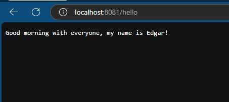

# Go Hello World HTTP Server

This project demonstrates how to create a simple HTTP server in Go that responds with a greeting message when the `/hello` route is accessed.

## Description

This Go application starts an HTTP server that listens on port `8081`. When a request is made to the `/hello` endpoint, the server responds with the message "Good morning with everyone, my name is Edgar!".

## Features

- Simple HTTP server in Go.
- Responds with a greeting message on the `/hello` endpoint.
- Written using the Go standard library (`net/http`).

## Prerequisites

To run this application locally, you will need:

- Go installed (Go 1.18 or newer).

## Installation

### Clone the repository

```bash
git clone https://github.com/epgarzonr10/GoService.git
cd GoHelloWorld
```
## Results
<p align="center">
  
</p>

> [!IMPORTANT]
> When running the Go application, execute the following command in the terminal:
> 
> ```
> go run hello.go
> ```
> 
> The terminal will not display any output unless there is an error. Once the application is running, open your web browser and navigate to:
> 
> ```
> http://localhost:8081/hello
> ```
> 
> Ensure that you are accessing the correct route (`/hello`) and port (`8081`) as specified in the Go code. The server will respond with the greeting message.
